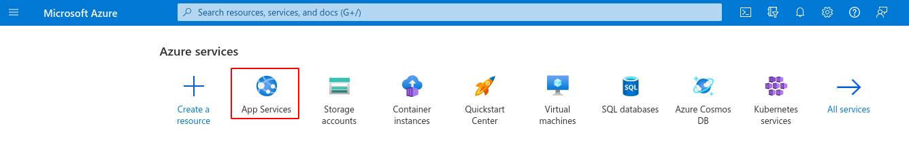
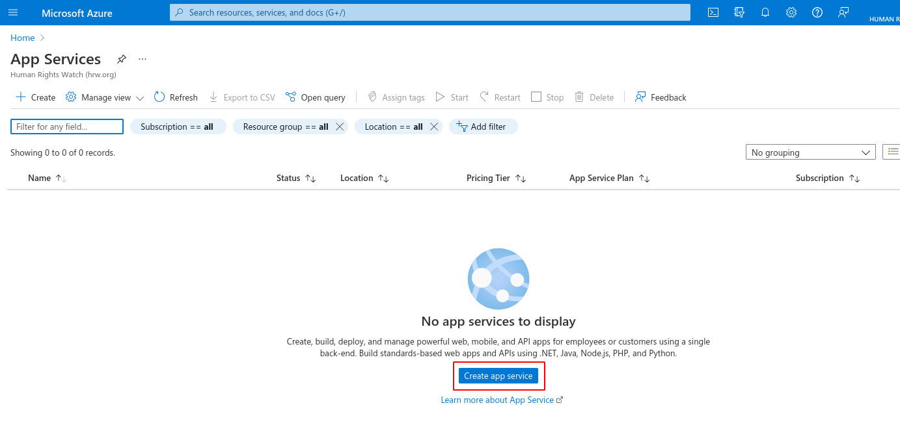
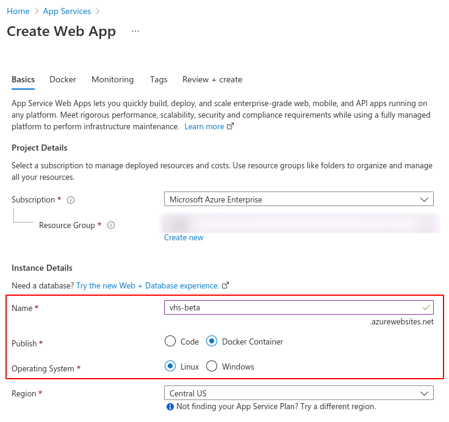
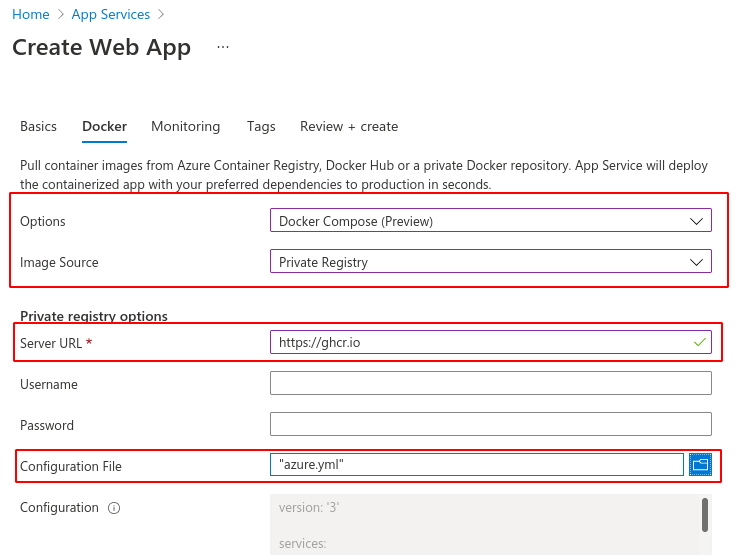
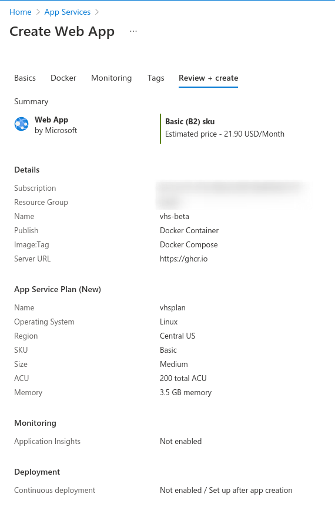
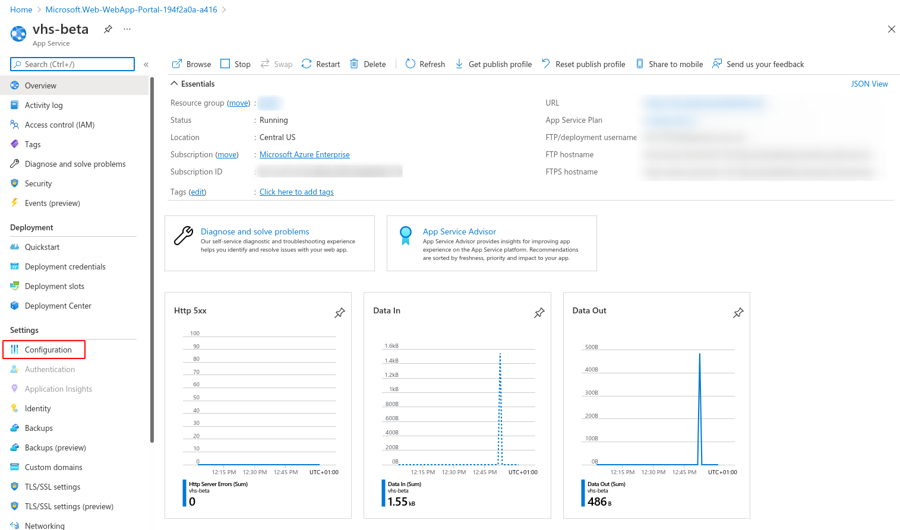
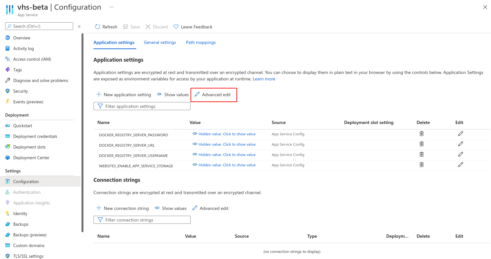
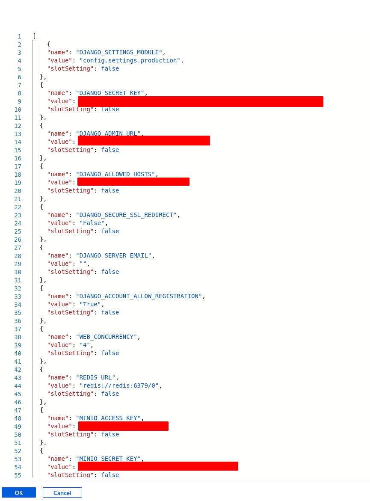
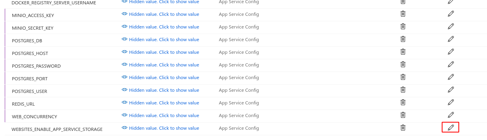
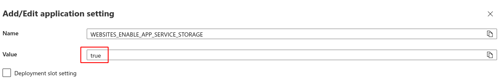

# How to deploy VHS on Azure
Here is a step-by-step guide explaining how to deploy VHS as an App Service on Microsoft Azure.

## Create an app service
Add the top of you dashboard, click on **App Services**



and then click on **Create app service** to host your VHS instance.



## Global configuration of the app service
First, you have to carefully choose a name, this name will be the subdomain (`<name>.azurewebsites.net`) exposing your App Service. Then, select *Docker Container* and *Linux*.



Not illustrated here, you have to select a hosting plan for your app service at the bottom of the current page.

## Configure Docker
Since VHS is based on multiple services, they are defined in a single Docker Compose file. VHS Docker image is automatically built and [provided by GitHub](https://github.com/HumanRightsWatch/VHS/pkgs/container/vhs).

So, in the Azure configuration form, choose:

* Docker Compose
* Private Registry

Then specify `https://ghcr.io` as Docker registry URL. Finally, upload the `azure.yml` you can download from [VHS GitHub repository](https://github.com/HumanRightsWatch/VHS/blob/main/azure.yml).



## Monitoring and Tags
You can skip those steps.

## Review & Create
Here is what the summary should look like.



Click on **Create**

## Configure VHS
To configure VHS itself, click on **Configuration** listed in the left bar of the dashboard



then click on **Advanced edit**.



A JSON editor appears. First, adapt the following configuration according to your needs and then copy/paste it into the editor.

```json
  {
    "name": "DJANGO_SETTINGS_MODULE",
    "value": "config.settings.production",
    "slotSetting": false
  },
  {
    "name": "DJANGO_SECRET_KEY",
    "value": "<randomly generated secret key>",
    "slotSetting": false
  },
  {
    "name": "DJANGO_ADMIN_URL",
    "value": "<randomly generated string>/",
    "slotSetting": false
  },
  {
    "name": "DJANGO_ALLOWED_HOSTS",
    "value": "<name of the App Service>.azurewebsites.net",
    "slotSetting": false
  },
  {
    "name": "DJANGO_SECURE_SSL_REDIRECT",
    "value": "False",
    "slotSetting": false
  },
  {
    "name": "DJANGO_SERVER_EMAIL",
    "value": "",
    "slotSetting": false
  },
  {
    "name": "DJANGO_ACCOUNT_ALLOW_REGISTRATION",
    "value": "True",
    "slotSetting": false
  },
  {
    "name": "WEB_CONCURRENCY",
    "value": "4",
    "slotSetting": false
  },
  {
    "name": "REDIS_URL",
    "value": "redis://redis:6379/0",
    "slotSetting": false
  },
  {
    "name": "MINIO_ACCESS_KEY",
    "value": "<randomly generated key>",
    "slotSetting": false
  },
  {
    "name": "MINIO_SECRET_KEY",
    "value": "<randomly generated secret key>",
    "slotSetting": false
  },
  {
    "name": "POSTGRES_HOST",
    "value": "postgres",
    "slotSetting": false
  },
  {
    "name": "POSTGRES_PORT",
    "value": "5432",
    "slotSetting": false
  },
  {
    "name": "POSTGRES_DB",
    "value": "video_downloading_platform",
    "slotSetting": false
  },
  {
    "name": "POSTGRES_USER",
    "value": "<randomly generated user name>",
    "slotSetting": false
  },
  {
    "name": "POSTGRES_PASSWORD",
    "value": "<randomly generated password>",
    "slotSetting": false
  },
  {
    "name": "ADMIN_PASSWORD",
    "value": "<randomly generated password>",
    "slotSetting": false
  },
```

At the end, the JSON configuration should look like this:



# Persistence
In order to keep data across updates and restarts, we set `WEBSITES_ENABLE_APP_SERVICE_STORAGE` to `true`




# Save changes
Finally, save your changes. Your app service will restart within few minutes and will be accessible at `<your app service name>.azurewebsites.net`.
